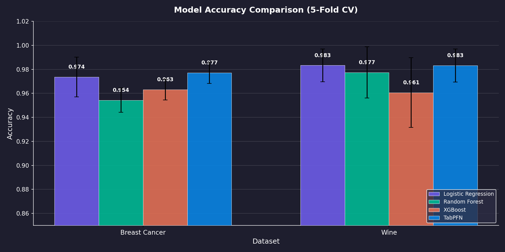
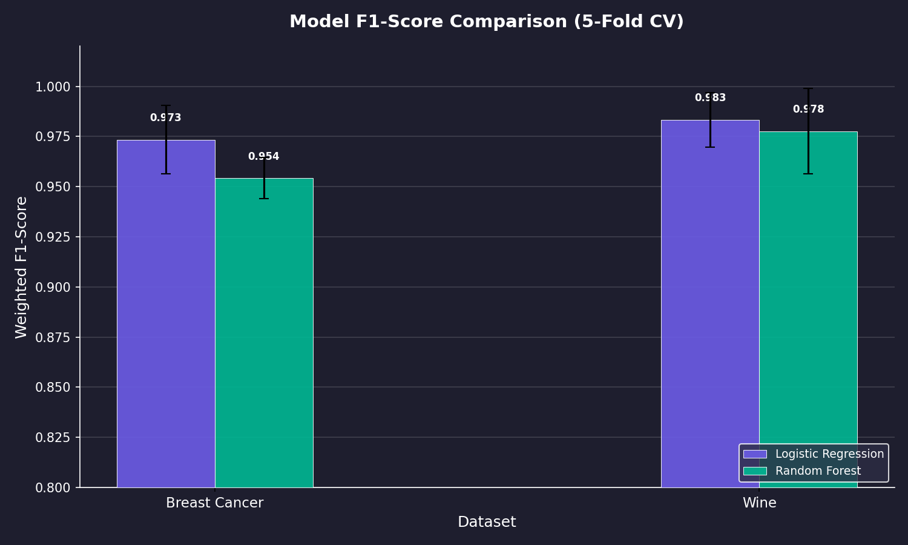

# Deep Learning Short Story — Beyond LLMs: The Rise of Tabular Foundation Models

## Paper Reviewed

**TabPFN-2.5: Advancing the State of the Art in Tabular Foundation Models**
*Yu, Jablonski, Hoo, Garg, Robertson, Bühler et al. — Prior Labs & University of Freiburg, 2025*
[arXiv:2511.08667](https://arxiv.org/abs/2511.08667)

---

## Deliverables

| Deliverable | Link |
|-------------|------|
| 📝 **Medium Article** | [Beyond LLMs: The Rise of Tabular Foundation Models](https://medium.com/@bhanagearshan/beyond-llms-the-rise-of-tabular-foundation-models-f2c33f96684a) |
| 📊 **SlideShare Presentation** | [SlideShare](https://www.slideshare.net/slideshow/beyond-llms-the-rise-and-impact-of-tabular-foundation-models-like-tabpfn-2-5/287402235) |
| 🎥 **YouTube Video** | [Watch on YouTube](https://youtu.be/93izObEFPtQ) |
| 📄 **Slides PDF** | [`slides/short_story_slides.pdf`](slides/short_story_slides.pdf) |
| 📄 **Slides PPTX** | [`slides/short_story_slides.pptx`](slides/short_story_slides.pptx) |
| 🔬 **Reproduction Notebook** | [`https://colab.research.google.com/drive/1JX4fX-Rkbf0_BYvNXQoK28sShLvaZx6y?usp=sharing`](https://colab.research.google.com/drive/1JX4fX-Rkbf0_BYvNXQoK28sShLvaZx6y?usp=sharing) |
| 📈 **Results CSV** | [`reproduction/results/metrics.csv`](reproduction/results/metrics.csv) |
| 📝 **Paper Summary** | [`paper/paper_summary.md`](paper/paper_summary.md) |
| 📝 **Article Draft** | [`article/medium_draft.md`](article/medium_draft.md) |

---

## Summary

This project is a deep dive into **Tabular Foundation Models (TFMs)** — a new class of pre-trained transformers designed for tabular (structured) data. The paper reviewed, **TabPFN-2.5**, demonstrates that a single forward pass through a pre-trained transformer can match or beat extensively tuned gradient-boosted tree methods (XGBoost, CatBoost, LightGBM) and even 4-hour AutoGluon ensembles.

### Key Contributions of the Paper
- Scales in-context learning to **50,000 samples and 2,000 features**
- Introduces **"thinking rows"** — learned dummy inputs providing extra computational capacity
- Achieves **state-of-the-art** on the TabArena benchmark with zero hyperparameter tuning
- Provides **distillation engines** for fast production deployment (MLP/Tree ensemble)

---

## Reproduction Experiment

I reproduced the paper's core claim by comparing four models on two sklearn datasets:

| Dataset | Model | Accuracy | F1-Score |
|---------|-------|----------|----------|
| Breast Cancer | Logistic Regression | 0.974 | 0.973 |
| Breast Cancer | Random Forest | 0.954 | 0.954 |
| Breast Cancer | XGBoost | 0.963 | 0.963 |
| Breast Cancer | **TabPFN** | **0.977** | **0.977** |
| Wine | Logistic Regression | 0.983 | 0.983 |
| Wine | Random Forest | 0.978 | 0.978 |
| Wine | XGBoost | 0.961 | 0.960 |
| Wine | **TabPFN** | **0.983** | **0.983** |

**Finding:** TabPFN achieves the highest accuracy on Breast Cancer and ties for the top on Wine — all with zero tuning. This confirms the paper's claim that tabular foundation models are strong default classifiers.

### Figures

| | |
|---|---|
|  |  |

### How to Run

[](https://colab.research.google.com/github/ArshanBhanage/Deep-Learning---Short-Story/blob/main/reproduction/run_experiment_colab.ipynb)

1. Click the badge above to open in Google Colab
2. Set runtime to **GPU** (Runtime → Change runtime type → T4 GPU)
3. Run all cells

---

## Repository Structure

```
Deep-Learning---Short-Story/
├── README.md                          # This file
├── paper/
│   ├── paper_summary.md               # Detailed paper summary (own words)
│   └── 2501.02945v4.pdf               # Reference PDF
├── article/
│   ├── medium_draft.md                # Full Medium article draft
│   ├── medium_draft.html              # HTML version
│   └── citations.md                   # All references
├── reproduction/
│   ├── README.md                      # Experiment documentation
│   ├── run_experiment_colab.ipynb     # Colab notebook (GPU)
│   ├── requirements.txt              # Python dependencies
│   ├── results/
│   │   └── metrics.csv               # Numeric results
│   └── figures/
│       ├── model_accuracy_comparison.png
│       └── model_f1_comparison.png
├── slides/
│   ├── short_story_slides.pptx       # Presentation slides
│   └── short_story_slides.pdf        # PDF export
└── autoresearch/
    └── experiment_log.md             # Experiment iteration log
```

---

## References

1. Yu, R. et al. (2025). *TabPFN-2.5: Advancing the State of the Art in Tabular Foundation Models.* [arXiv:2511.08667](https://arxiv.org/abs/2511.08667)
2. Hollmann, N. et al. (2022). *TabPFN: A Transformer That Solves Small Tabular Classification Problems in a Second.* [arXiv:2207.01848](https://arxiv.org/abs/2207.01848)
3. Chen, T. & Guestrin, C. (2016). *XGBoost: A Scalable Tree Boosting System.* [arXiv:1603.02754](https://arxiv.org/abs/1603.02754)
4. Erickson, N. et al. (2020). *AutoGluon-Tabular: Robust and Accurate AutoML for Structured Data.* [arXiv:2003.06505](https://arxiv.org/abs/2003.06505)
5. Erickson, N. et al. (2025). *TabArena: A Living Benchmark for Machine Learning on Tabular Data.* [GitHub](https://github.com/autogluon/tabarena)

---

*Author: Arshan Bhanage | Deep Learning Short Story Assignment | Spring 2025*
